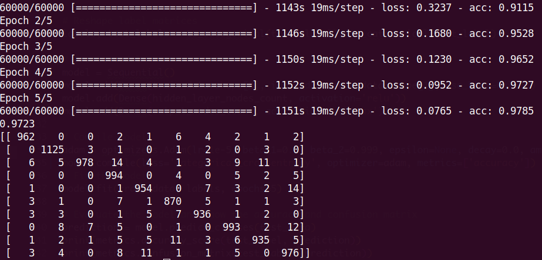

# Neural Network

Build a two-layer neural network for the hand-written digits recognition task with the MNIST data set. The hidden layer has 512 nodes, and adopts the ReLU activation function; the output layer has 10 nodes, and adopts the softmax activation function. Use the cross-entropy error function, and run 5 epochs. Give the recognition accuracy rate and show the confusion matrix, both for the test set.




## Get started

> First time

```bash
make all
```

> After first time

```bash
make start
```


## Dependency:

- Python 3+
- numpy
- sklearn
- keras
